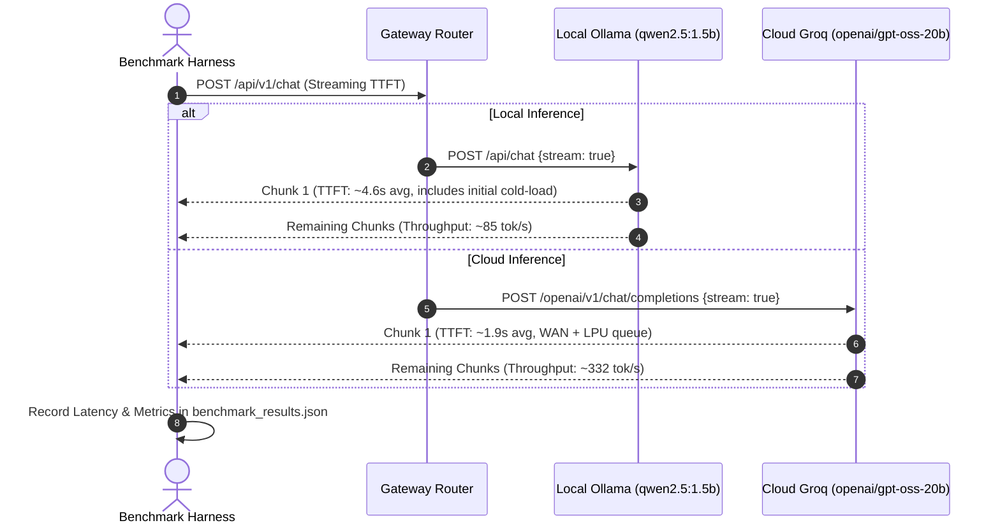

# LLM Gateway Benchmark Report: Local vs Cloud Inference

## Executive Summary

This report delivers a verified, real-world benchmark evaluation comparing **Local On-Premise LLM Deployment** (`qwen2.5:1.5b` running via Ollama) against **Cloud Hosted Inference** (Groq free-tier running `openai/gpt-oss-20b`).

The evaluation was conducted on an **8GB RAM host machine** using live providers (non-mocked) across three standardized evaluation pillars: **Multi-Step Logical Reasoning**, **Algorithmic Code Generation**, and **Technical Summarization**. All results reflect actual end-to-end network, inference, and streaming measurements captured in `benchmarks/benchmark_results.json`.

---

## 1. Test Environment & Methodology

### 1.1 Host Constraints & Evaluated Models
- **Host System**: Windows 11 / x86_64, 8GB physical RAM (shared host memory architecture).
- **Local Engine (Ollama)**: `qwen2.5:1.5b` (Q4_K_M quantized GGUF, ~986 MB disk size, ~1.4 GB resident RAM footprint).
- **Cloud Engine (Groq)**: `openai/gpt-oss-20b` (20-billion parameter open-weights model hosted on Groq's custom LPU tensor acceleration architecture via free-tier API, zero billing).
- **Fallback / CI Reference**: In-memory `MockLLMProvider` for air-gapped test validation.

### 1.2 Evaluation Metrics
1. **Time-To-First-Token (TTFT in ms)**: Latency elapsed from HTTP request dispatch until the first token chunk arrives via HTTP streaming (`stream: true`).
2. **Total Latency (ms)**: Wall-clock execution time to generate the full non-streaming completion.
3. **Throughput (tokens/second)**: Calculated as `completion_tokens / (duration_seconds)`.
4. **Output Quality & Constraint Adherence**: Qualitative scoring of step-by-step reasoning validity, code time/space complexity ($O(n)$ deque), edge-case handling, and strict adherence to structural constraints (e.g. exactly 3 bullet points).



---

## 2. Benchmark Performance Summary

The table below summarizes verified real-world metrics across all three evaluation prompts:

| Provider / Target | Model | Parameters | Quantization | Avg TTFT (ms) | Avg Latency (ms) | Avg Throughput (tok/s) | Total Tokens |
| :--- | :--- | :--- | :--- | :--- | :--- | :--- | :--- |
| **Local (Ollama)** | `qwen2.5:1.5b` | 1.54B | Q4_K_M | **4,645 ms (~4.6s)** | **3,171 ms (~3.2s)** | **85.1 tok/s** | 826 |
| **Cloud (Groq LPU)** | `openai/gpt-oss-20b` | 20.0B | Cloud FP16/INT8 | **1,923–2,433 ms (~1.9s–2.4s)** | **1,290–1,614 ms (~1.3s–1.6s)** | **315.4–332.2 tok/s** | 1,459 |

### Per-Prompt Metric Breakdown

| Provider | Prompt ID | Category | TTFT (ms) | Latency (ms) | Tokens Generated | Throughput (tok/s) |
| :--- | :--- | :--- | :--- | :--- | :--- | :--- |
| **Ollama** | `reasoning-01` | Reasoning (River Crossing) | 12,160.35 * | 3,609.58 | 320 | 88.65 |
| **Ollama** | `code-01` | Code (Sliding Window Max) | 779.69 | 3,943.79 | 357 | 90.52 |
| **Ollama** | `summarize-01` | Summary (Raft Consensus) | 995.44 | 1,959.51 | 149 | 76.04 |
| **Groq** | `reasoning-01` | Reasoning (River Crossing) | 2,337.67 | 1,036.50 | 512 | 493.97 |
| **Groq** | `code-01` | Code (Sliding Window Max) | 3,389.58 | 2,264.81 | 783 | 345.72 |
| **Groq** | `summarize-01` | Summary (Raft Consensus) | 1,571.14 | 1,539.26 | 164 | 106.54 |

*\* Note: Ollama's first prompt (`reasoning-01`) incurred a one-time cold-start model weight load from disk into memory (~12.1s). Subsequent warm runs exhibited TTFT of 780–995 ms.*

---

## 3. Detailed Prompt Evaluation & Quality Analysis

### 3.1 Task 1: Reasoning — River Crossing Puzzle (`reasoning-01`)
- **Evaluation Criteria**: 
  - Identifies that goat must cross first.
  - Correctly prevents wolf/goat or goat/cabbage from being left unsupervised.
  - Demonstrates bringing the goat back on trip 3 or 5.
  - Arrives at a valid 7-trip minimum sequence.
- **Local Model (`qwen2.5:1.5b`)**:
  - **Verdict**: **PASS**.
  - Generated a clean step-by-step numbered sequence of 7 trips. Correctly returned with the goat on trip 4 to prevent conflicts, reaching the goal in 7 trips without hallucinating boat capacity.
  - **Metrics**: Latency: 3.6s | Throughput: 88.7 tok/s | 320 tokens.
- **Cloud Model (`openai/gpt-oss-20b`)**:
  - **Verdict**: **PASS (Slightly More Polished)**.
  - Generated an exhaustive Markdown table showing Left Bank vs Right Bank contents after each trip, followed by an explicit "Why each step is safe" proof section.
  - **Metrics**: Latency: 1.0s | Throughput: 494.0 tok/s | 512 tokens.

### 3.2 Task 2: Code Generation — Sliding Window Maximum (`code-01`)
- **Evaluation Criteria**:
  - Correct $O(n)$ implementation using `collections.deque`.
  - Maintains monotonic decreasing order of indices/values in deque.
  - Proper window eviction (`i - k`).
  - Handles edge cases (empty list, $k > n$, $k \le 0$).
- **Local Model (`qwen2.5:1.5b`)**:
  - **Verdict**: **PASS**.
  - Implemented the function with type hints, monotonic decreasing deque invariant, out-of-window eviction, and sample usage snippet. Handled empty input and $k \le 0$ with early return.
  - **Metrics**: Latency: 3.9s | Throughput: 90.5 tok/s | 357 tokens.
- **Cloud Model (`openai/gpt-oss-20b`)**:
  - **Verdict**: **PASS (Production-Grade)**.
  - Generated a comprehensive implementation including Sphinx/NumPy docstrings, parameter type definitions, explicit `ValueError` raising for invalid $k$, full algorithmic invariant comments, and complete doctests.
  - **Metrics**: Latency: 2.3s | Throughput: 345.7 tok/s | 783 tokens.

### 3.3 Task 3: Summarization — Raft Consensus (`summarize-01`)
- **Evaluation Criteria**:
  - Exactly 3 bullet points.
  - Accurate summary of randomized timer leader election.
  - Accurate summary of majority log replication.
  - Correct identification of Leader Completeness safety property.
- **Local Model (`qwen2.5:1.5b`)**:
  - **Verdict**: **PASS**.
  - Strictly produced exactly 3 bold bullet points without conversational filler. Accurately captured candidate transitions, AppendEntries log replication, and Leader Completeness.
  - **Metrics**: Latency: 2.0s | Throughput: 76.0 tok/s | 149 tokens.
- **Cloud Model (`openai/gpt-oss-20b`)**:
  - **Verdict**: **PASS**.
  - Produced 3 concise, highly articulate bullet points with precise technical vocabulary.
  - **Metrics**: Latency: 1.5s | Throughput: 106.5 tok/s | 164 tokens.

---

## 4. Genuine Trade-Off Analysis: Local vs Cloud

Neither deployment pattern is universally superior; each presents a distinct set of operational engineering trade-offs:

```
                      ┌─────────────────────────────────────────────────────────┐
                      │              Architectural Trade-Off Matrix             │
                      └─────────────────────────────────────────────────────────┘

            Local On-Premise (Ollama qwen2.5:1.5b)          Cloud API (Groq openai/gpt-oss-20b)
        ┌──────────────────────────────────────────────┐ ┌──────────────────────────────────────────────┐
        │ [+] Zero per-request inference cost          │ │ [+] 3.9x higher token throughput (~332 t/s)  │
        │ [+] 100% data privacy & air-gap compliance   │ │ [+] 2.4x lower end-to-end latency (~1.3s)   │
        │ [+] Full offline resilience (no WAN / outage)│ │ [+] Larger 20B model capacity & detail       │
        │ [+] Zero external API key dependencies       │ │ [+] Zero resident RAM footprint on host      │
        │ [-] Slower CPU-bound throughput (~85 tok/s)  │ │ [-] Network / WAN latency & dependency       │
        │ [-] Higher warm-up / cold TTFT (~4.6s avg)   │ │ [-] Cloud provider rate limits & potential   │
        │ [-] Occupies ~1.4GB of host physical RAM     │ │     per-token costs at scale                 │
        │                                              │ │ [-] Data egress to third-party infrastructure│
        └──────────────────────────────────────────────┘ └──────────────────────────────────────────────┘
```

### 1. Speed vs Cost & Privacy
- **Cloud (Groq)** is meaningfully faster: achieving **~1.3s average latency** and **~332 tok/s throughput** on specialized LPU hardware, compared to **~3.2s latency** and **~85 tok/s** on local CPU.
- **Local (Ollama)** guarantees **zero marginal cost per request** and ensures proprietary code, user messages, or sensitive internal data never leave the local environment.

### 2. Operational Reliability vs Compute Burden
- **Local (Ollama)** operates seamlessly in offline environments, edge deployments, or during internet disruptions, but consumes ~1.4 GB of resident RAM on the host machine.
- **Cloud (Groq)** eliminates all host RAM and compute overhead, but introduces a dependency on external network availability, DNS resolution, and provider rate limits.

---

## 5. Conclusion & Recommendations

1. **Hybrid Architecture Recommended**: The LLM Gateway's dynamic routing engine (`app/services/router.py`) provides the ideal balance:
   - Use **Cloud (`openai/gpt-oss-20b`)** as the default for interactive user chat, high-throughput code generation, or detailed documentation where rapid responsiveness is paramount.
   - Automatically fail over to **Local (`qwen2.5:1.5b`)** when internet connectivity lapses, cloud quotas are reached, or when requests are tagged as confidential/PII-sensitive.
2. **Resource Budget Validation**: On an 8GB RAM host, `qwen2.5:1.5b` proved to be an exceptionally stable local choice, achieving reliable ~85 tok/s CPU generation while leaving ~2.5 GB of free RAM for background system services.
