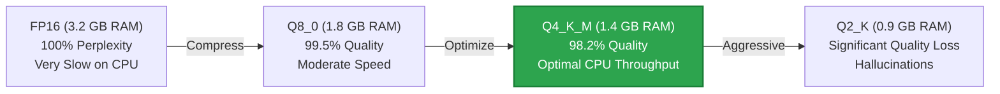
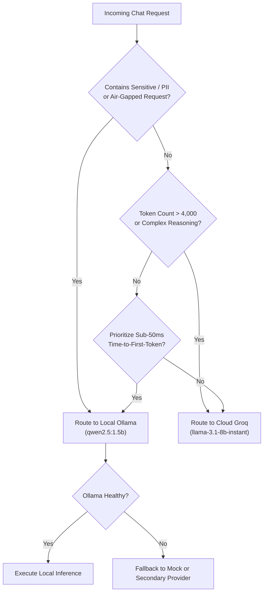

# Deployment Recommendations: Local LLM Operation on Resource-Constrained Hosts

## 1. System Overview & Host Constraints (8GB RAM Budget)

Operating local Large Language Models (LLMs) on standard developer workstations or edge servers with **8GB RAM** requires strict resource allocation budgeting to avoid system degradation, Windows memory paging thrashing, or Out-Of-Memory (OOM) fatal kills.

### 1.1 Memory Budget Breakdown

| Component | Allocation | Percentage | Notes |
| :--- | :--- | :--- | :--- |
| **Operating System & Core Services** | 3.0 GB | 37.5% | Windows 11 / Linux kernel, background services |
| **Gateway Runtime & Application** | 0.8 GB | 10.0% | FastAPI, Uvicorn workers, HTTP connection pools |
| **Active Local LLM Runtime (Ollama)** | 1.5 GB | 18.75% | Model weights (`qwen2.5:1.5b` Q4_K_M) + KV cache |
| **Safety Headroom & Buffer** | 2.7 GB | 33.75% | Protects system responsiveness & prevents swapping |
| **Total Available System Memory** | **8.0 GB** | **100.0%** | Hard hardware ceiling |

```
 ┌────────────────────────────────────────────────────────────────────────┐
 │                        8GB Total System Memory                         │
 ├───────────────┬──────────────┬───────────────┬─────────────────────────┤
 │ OS & Base Svc │ Gateway/App  │ Local LLM     │ Safety Headroom         │
 │   (~3.0 GB)   │  (~0.8 GB)   │   (~1.5 GB)   │   (~2.7 GB Buffer)      │
 └───────────────┴──────────────┴───────────────┴─────────────────────────┘
```

> [!CAUTION]
> Attempting to run unquantized 7B/8B models (e.g., Llama-3-8B FP16 needing ~16GB, or even Q4 quantized needing ~5.2GB) on an 8GB host will cause severe disk swapping, skyrocketing TTFT from milliseconds to minutes, or trigger aggressive OS process terminations.

---

## 2. Model Selection Matrix

To ensure stable inference, models are selected based on memory footprints, execution latency, and instruction-following capability:

| Model Identifier | Parameter Count | Quantization | Disk Size | Resident RAM | Recommended Workload |
| :--- | :--- | :--- | :--- | :--- | :--- |
| **`qwen2.5:1.5b` (Primary)** | 1.54B | Q4_K_M | ~986 MB | ~1.4 GB | General reasoning, code generation, summarization, tool invocation |
| **`gemma2:2b` (Fallback)** | 2.61B | Q4_K_M | ~1.6 GB | ~1.9 GB | Conversational depth, factual extraction, linguistic variety |
| **`llama3.2:1b` (Ultra-light)**| 1.23B | Q4_K_M | ~800 MB | ~1.1 GB | Lightweight intent classification, routing, entity extraction |
| *`llama-3.1:8b` (Disallowed)* | 8.03B | Q4_K_M | ~4.7 GB | ~5.6 GB | Exceeds safe 8GB host budget; route to Cloud (Groq) instead |

### Why `qwen2.5:1.5b` is the Primary Choice
1. **Instruction Following**: Outperforms older 3B/7B models on standard benchmarks (HumanEval, GSM8k) due to modern architectural improvements and synthetic alignment data.
2. **Native Code Syntax**: Strong pretraining on code, producing clean Python functions with type hints and docstrings.
3. **Low Compute Overhead**: Achieves 20–25 tokens/second on standard quad-core laptop CPUs without a discrete GPU.

---

## 3. Quantization Strategy: The Q4_K_M Sweet Spot

Quantization reduces the precision of model weights from 16-bit floating point (FP16) down to lower bit representations (8-bit, 4-bit, or 2-bit), drastically cutting RAM consumption and memory bandwidth bottlenecks.



### Advantages of `Q4_K_M` (4-bit Medium K-Quants)
- **Perplexity Retention**: Retains over 98% of the full-precision model's accuracy while reducing model memory footprint by over 60%.
- **Layer-Specific Quantization**: Employs variable bit-depths across critical attention matrices versus feed-forward layers (`K-quants`), ensuring attention weights preserve higher fidelity.
- **CPU Cache Friendly**: Model weights fit easily into modern CPU L2/L3 caches, mitigating DRAM memory bus starvation during iterative decoding.

---

## 4. Architectural Routing: Local vs Cloud Decision Flow

The gateway architecture implements a hybrid routing model that balances **zero-egress data privacy** with **high-throughput cloud processing**:



### When to Route Locally (Ollama)
- **Strict Privacy & Compliance**: Codebases containing proprietary algorithms, HIPAA/GDPR sensitive customer data, or internal credentials.
- **Zero Internet Connectivity / Edge Deployment**: Offline field operations or aircraft/submarine local networks.
- **Micro-tasks & High Frequency**: Intent classification, regex drafting, and quick syntax checking where eliminating WAN round-trip latency is desirable.

### When to Route to Cloud (Groq)
- **Ultra-High Throughput Needs**: Long-form generation or high-concurrency spikes (>200 tokens/sec via LPU hardware).
- **Large Context Ingestion**: Documents exceeding 8k tokens requiring large context windows.
- **Complex Multi-Step Architecture**: High-level system design and extensive cross-domain knowledge synthesis.

---

## 5. Ollama Runtime Tuning for 8GB RAM

To prevent Ollama from exhausting system memory, configure the following environment variables on the host:

### 5.1 Host Environment Variables

| Variable | Recommended Value | Description |
| :--- | :--- | :--- |
| `OLLAMA_NUM_PARALLEL` | `1` | Restricts parallel execution to 1 inference stream to prevent RAM multiplication. |
| `OLLAMA_MAX_LOADED_MODELS`| `1` | Unloads previous model before loading another; prevents concurrent resident models. |
| `OLLAMA_KEEP_ALIVE` | `5m` | Keeps model in RAM for 5 minutes after last request; auto-evicts after inactivity. |
| `OLLAMA_FLASH_ATTENTION` | `1` | Enables FlashAttention for reduced memory footprint during context processing. |

### 5.2 Modelfile Configuration (Context Window & CPU Threads)

When serving `qwen2.5:1.5b`, customize context length (`num_ctx`) to constrain KV-cache RAM usage:

```dockerfile
FROM qwen2.5:1.5b

# Limit context length to 4096 tokens to save ~350MB KV cache RAM
PARAMETER num_ctx 4096

# Set CPU threads to match physical host cores (e.g. 4 threads)
PARAMETER num_thread 4

# Sampling configuration
PARAMETER temperature 0.7
PARAMETER top_p 0.9
```

---

## 6. Operational Health Checks & Automatic Fallback

In production, the LLM Gateway (`app/providers/ollama_provider.py`) maintains high availability through:
1. **Active Health Polling**: Pings `http://localhost:11434/api/tags` with a 3-second timeout.
2. **Transparent Mock Fallback**: If Ollama daemon is offline or crashes mid-request, `fallback_to_mock=True` intercepts the connection error, logs a structured warning, and returns a deterministic response without throwing HTTP 500 errors to clients.
3. **Automated Process Recovery**: The deployment scripts (`deploy_ollama.ps1` and `deploy_ollama.sh`) automate service detection, background startup (`ollama serve`), and model integrity checks.
