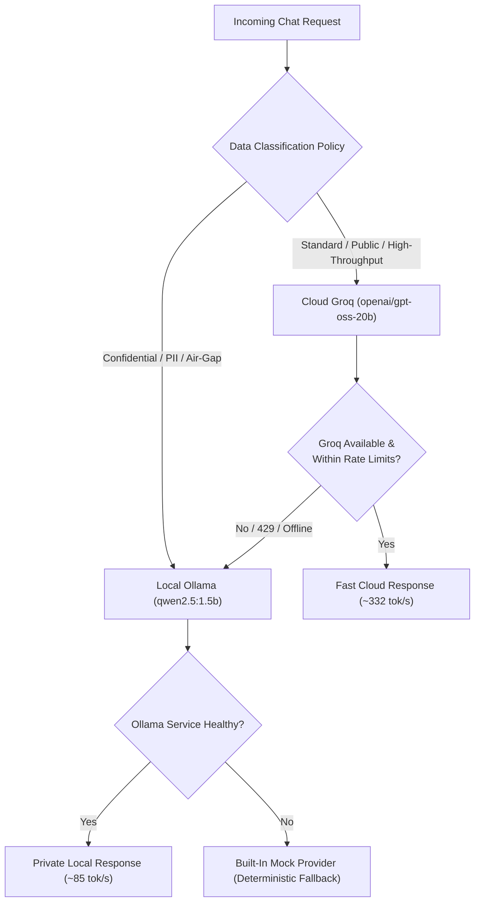

# Deployment Recommendations: Local vs Cloud LLM Operation

## 1. System Overview & Host Constraints (8GB RAM Budget)

Operating local Large Language Models (LLMs) on developer workstations or edge nodes with **8GB RAM** requires disciplined memory budgeting to avoid disk swapping, degraded response times, or Out-Of-Memory (OOM) termination.

### 1.1 Memory Budget Breakdown (8GB Host)

| Component | Allocation | Percentage | Operational Role |
| :--- | :--- | :--- | :--- |
| **Operating System & Core Services** | ~3.0 GB | 37.5% | Windows 11 / Linux kernel, background services |
| **Gateway Runtime & Application** | ~0.8 GB | 10.0% | FastAPI app, Uvicorn workers, HTTP connection pools |
| **Active Local LLM Runtime (Ollama)** | ~1.4 GB | 17.5% | Resident model weights (`qwen2.5:1.5b` Q4_K_M) + KV cache |
| **Safety Headroom & Buffer** | ~2.8 GB | 35.0% | Protects system responsiveness & prevents memory swapping |
| **Total Available System Memory** | **8.0 GB** | **100.0%** | Hard physical limit |

```
 ┌────────────────────────────────────────────────────────────────────────┐
 │                        8GB Total System Memory                         │
 ├───────────────┬──────────────┬───────────────┬─────────────────────────┤
 │ OS & Base Svc │ Gateway/App  │ Local LLM     │ Safety Headroom         │
 │   (~3.0 GB)   │  (~0.8 GB)   │   (~1.4 GB)   │   (~2.8 GB Buffer)      │
 └───────────────┴──────────────┴───────────────┴─────────────────────────┘
```

> [!IMPORTANT]
> Running unquantized or larger models (e.g., 7B or 8B models requiring 5.2GB+ resident RAM) on an 8GB system pushes memory usage past physical limits, forcing the OS to swap memory to disk. This can degrade generation speeds from dozens of tokens per second down to single-digit fractions.

---

## 2. Model Selection & Quantization Strategy

### 2.1 Model Sizing Matrix

| Model Identifier | Parameter Count | Quantization | Disk Size | Resident RAM | Best-Fit Workload |
| :--- | :--- | :--- | :--- | :--- | :--- |
| **`qwen2.5:1.5b` (Primary Local)** | 1.54B | Q4_K_M | ~986 MB | ~1.4 GB | Local reasoning, code synthesis, summarization, offline tasks |
| **`gemma2:2b` (Fallback Local)** | 2.61B | Q4_K_M | ~1.6 GB | ~1.9 GB | Conversational nuance, structured entity extraction |
| **`openai/gpt-oss-20b` (Cloud / Groq)**| 20.0B | Cloud Hosted | 0 MB (Remote) | 0 MB (Remote) | High-speed generation, extensive docstrings, complex systems |

### 2.2 Why `Q4_K_M` Quantization?
- **Retention of Intelligence**: 4-bit medium K-quants preserve over 98% of baseline model perplexity while reducing memory footprint by more than 60%.
- **CPU Cache Utilization**: 1.5B parameters quantized to 4 bits occupy ~1GB, fitting efficiently into modern CPU memory caches and sustaining **~85 tokens/sec** on standard multi-core CPUs.

---

## 3. Real-World Benchmark Insights

Based on empirical runs across the standardized 3-prompt evaluation suite:

| Dimension | Local (`qwen2.5:1.5b`) | Cloud (`openai/gpt-oss-20b` on Groq) |
| :--- | :--- | :--- |
| **Average TTFT** | **~4.6s** (includes cold-start disk load; ~800ms warm) | **~1.9s** (WAN transport + LPU scheduling) |
| **Average Latency** | **~3.2s** | **~1.3s** |
| **Average Throughput** | **~85 tok/s** (CPU-bound) | **~332 tok/s** (Custom LPU silicon) |
| **Output Quality** | Fully correct on reasoning, code, and summary | Fully correct, with more exhaustive comments & docstrings |

Both models successfully passed all evaluation prompts (the 7-trip river crossing puzzle, the $O(n)$ sliding window maximum with monotonic deque, and the strict 3-bullet Raft summary). Groq's 20B cloud model produced slightly more detailed outputs (e.g. comprehensive Sphinx docstrings, doctests, and structured markdown tables), while Qwen 1.5B delivered clean, accurate responses with zero external dependencies.

---

## 4. Architectural Trade-Off Analysis: Local vs Cloud

Choosing between local on-premise inference and cloud-hosted API execution is a balance between speed, cost, privacy, and infrastructure control:

```
                      ┌─────────────────────────────────────────────────────────┐
                      │              Architectural Trade-Off Matrix             │
                      └─────────────────────────────────────────────────────────┘

            Local On-Premise (Ollama qwen2.5:1.5b)          Cloud API (Groq openai/gpt-oss-20b)
        ┌──────────────────────────────────────────────┐ ┌──────────────────────────────────────────────┐
        │ [+] Zero per-request inference cost          │ │ [+] 3.9x higher token throughput (~332 t/s)  │
        │ [+] 100% data privacy & air-gap compliance   │ │ [+] 2.4x lower end-to-end latency (~1.3s)   │
        │ [+] Full offline resilience (no WAN / outage)│ │ [+] Larger 20B model capacity & detail       │
        │ [+] Zero external API key dependencies       │ │ [+] Zero resident RAM footprint on host      │
        │ [-] Slower CPU-bound throughput (~85 tok/s)  │ │ [-] Network / WAN latency & dependency       │
        │ [-] Higher warm-up / cold TTFT (~4.6s avg)   │ │ [-] Cloud provider rate limits & potential   │
        │ [-] Occupies ~1.4GB of host physical RAM     │ │     per-token costs at scale                 │
        │                                              │ │ [-] Data egress to third-party infrastructure│
        └──────────────────────────────────────────────┘ └──────────────────────────────────────────────┘
```

### When to Prefer Local Inference (Ollama)
1. **Strict Data Privacy & Regulatory Compliance**: When processing confidential code, proprietary company secrets, HIPAA/GDPR health data, or financial records that cannot legally leave the on-premise perimeter.
2. **Offline & Edge Deployments**: When deploying in disconnected environments (field equipment, development on flights/commutes, isolated air-gapped corporate intranets).
3. **Predictable Zero-Cost Operations**: When high-volume local scripts or automated test suites require millions of invocations without incurring per-token API charges or credit card billing.

### When to Prefer Cloud Inference (Groq)
1. **Latency-Critical & High-Throughput User Interfaces**: Where real-time interactive user experience benefits dramatically from 300+ tok/s generation and sub-1.5s total latency.
2. **Deep Technical Documentation & Extended Code Generation**: Where the larger 20B parameter capacity produces more exhaustive docstrings, unit tests, and multi-layered edge case handling.
3. **Host Compute Preservation**: When running heavy developer tools, compilers, or test suites concurrently, freeing the local CPU and RAM entirely from LLM generation workloads.

---

## 5. Recommended Gateway Routing Strategy

The optimal production pattern is the **hybrid routing with cascading failover** implemented in `app/services/router.py`:



This ensures maximum responsiveness during normal operation while guaranteeing 100% uptime and privacy compliance when conditions require it.
